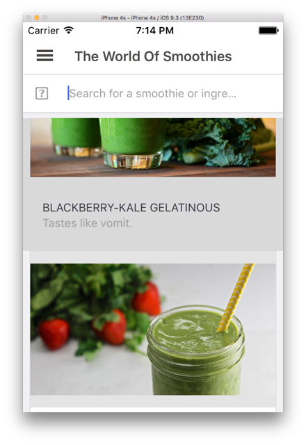

# Snppts.Foodies

Recently we've seen an increase in the amount of smoothies created at the office. Apparently they are the hype object of the month. So without further ado we bring you a sample product overview of smoothies. Yuk! This uses a simple hamburger menu (to counter the health level of these smoothies), a search bar and some custom fonts.



## โครงสร้างโปรเจค

```
├── SearchBarExample
│   ├── Models
│   │   └── Smoothies.cs
│   ├── PageModels
│   │   └── FoodPageModel.cs
│   ├── Pages
│   │   ├── FoodPage.xaml
│   │   ├── FoodPage.xaml.cs
│   │   ├── HambergerPage.xaml
│   │   ├── HambergerPage.xaml.cs
│   │   └── MasterDetail.cs
│   ├── Properties
│   │   └── AssemblyInfo.cs
│   └── SearchBarExample.cs
└── SearchBarExample.iOS
    ├── AppDelegate.cs
    ├── Assets.xcassets
    │   └── AppIcons.appiconset
    ├── CustomerRenders
    │   └── BorderlessEntryRenderer.cs
    ├── Main.cs
    └── Resources
        ├── bbs@2x.png
        ├── bkgss@2x.png
        ├── burger@2x.png
        ├── fads@2x.png
        ├── hamburger.png
        ├── hamburger@2x.png
        ├── hamburger@3x.png
        ├── sgs@2x.png
        └── snppts@2x.png
```

## Api ที่เกี่ยวข้อง

- ImplementPropertyChange - https://github.com/Fody/PropertyChanged
- FreshNavigationContainer - https://github.com/rid00z/FreshMvvm
- ExportRenderer - https://developer.xamarin.com/guides/xamarin-forms/custom-renderer